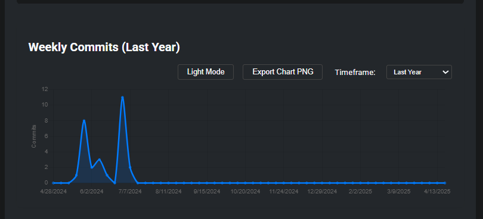

# GitHub Repo Analyzer

This project provides a straightforward tool for analyzing public GitHub repositories. Users can enter a GitHub repository URL to view key statistics and activity insights. The interface is clean, includes a dark mode, and provides feedback during data fetching via a loading animation.

## Project Purpose

The goal was to create a practical, easy-to-use application for quickly assessing any public GitHub repository. The project was built as part of a technical challenge, with a focus on clarity, reliability, and a concise user experience.

## How Core Requirements Are Met

- **Input for GitHub repo link**  
  The main page contains an input field where users can paste any public GitHub repository URL.

- **Fetch and display repo metadata (name, stars, forks, etc.)**  
  Upon submission, the backend retrieves repository metadata from the GitHub API, including the name, description, stars, forks, and more. This information is displayed directly on the page.

- **Display contributor and commit activity data**  
  The application fetches and displays a list of contributors, as well as recent commit activity, to provide insight into the project's activity and participation.

- **Handle rate-limiting or failed API calls gracefully**  
  If the GitHub API rate limit is reached or an error occurs, the application displays a clear and informative error message, ensuring the user is aware of the issue without experiencing a crash or freeze.

- **Additional features: dark mode, loading effect, extensibility**  
  The interface supports dark mode for visual comfort and includes a loading animation to indicate when data is being fetched. The project is structured to allow for easy addition of new metrics or features, such as commit frequency graphs.

## Credits and Acknowledgments

Cascade (AI assistant) assisted in structuring the project, setting up the initial skeleton, and expediting the completion of the HTML and CSS, including dark mode and the loading effect. This allowed for a greater focus on implementing the core features and ensuring a smooth user experience.

## Usage

1. Clone the repository and install the required dependencies.
2. Start the application.
3. Enter a public GitHub repository link and select analyze to view the results.

## Notes

- If the GitHub API rate limit is reached, please wait and try again later.
- The project is designed for straightforward extensibility; additional analytics or visualizations can be added as needed.

## Project Structure

- `app.py` — Flask backend server
- `github_api.py` — Functions for interacting with GitHub API
- `utils.py` — URL parsing and helpers
- `frontend.html` — Main web interface (HTML, CSS, JS)
- `requirements.txt` — Python dependencies

## Error Handling

- If the GitHub API rate limit is exceeded, a clear message is shown.
- If commit activity is still being generated by GitHub, the user is informed to try again later.
- All errors are handled gracefully in the UI.

## Efficiency & Possible Improvements

This project is already highly efficient for its purpose:
- **Minimal API Calls:** Only the necessary endpoints are queried, and results are processed efficiently.
- **Graceful Error Handling:** Prevents wasted requests and keeps the user informed.
- **Frontend Performance:** UI updates are fast, and only relevant DOM elements are re-rendered.

### Can it be made even more efficient?
- **Caching:** For heavy usage, caching popular repo data (server-side or client-side) could reduce API calls and improve speed.
- **Asynchronous Backend:** For very large repos, using async requests in Flask or a framework like FastAPI could improve scalability.
- **Batch API Requests:** If analyzing multiple repos at once, batching could help, but for single-repo analysis, current design is optimal.
- **Deployment:** For production, use a WSGI server (like Gunicorn) instead of Flask’s dev server.

## Screenshots

Below are some example screenshots demonstrating the main features and user experience of the GitHub Repo Analyzer:

### 1. Main Results Page (Light Mode)

Displays repository metadata, contributors, and commit activity after analyzing a valid public repository.

---

### 2. Commit Activity Chart (Dark Mode)

Shows the weekly commit activity chart in dark mode.

---

### 3. Loading State

Indicates that the application is fetching data from the GitHub API.

---

### 4. Error - Repository Not Found

Displays a clear error message if the repository does not exist.

---

### 5. Error - Invalid URL

Shows an error if the user enters an invalid GitHub repository URL.

---

Screenshots are placed in the `screenshots/` directory for clarity. Each image highlights a different aspect of the application's interface and error handling.

## License
MIT

## Credits
Built by Mohith with help from Cascade AI.
